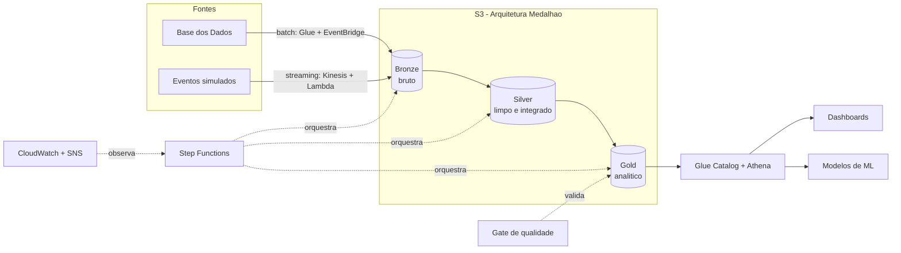

# Pipeline Híbrido de Alfabetização no Brasil

Projeto da Fase 2 do MBA em AI Scientist (FIAP / POSTECH). A proposta é construir uma pipeline de dados híbrida, batch e streaming, que integra as fontes públicas do Indicador Criança Alfabetizada e entrega uma camada analítica confiável para apoiar políticas públicas de educação. A solução roda na AWS, em arquitetura medalhão, e foi desenhada para ser provisionada e destruída em qualquer conta com um comando.

## Contexto do problema

A alfabetização ao final do 2º ano do ensino fundamental é um marco do desenvolvimento educacional, social e econômico. O Compromisso Nacional Criança Alfabetizada mobiliza União, estados, Distrito Federal e municípios para garantir esse direito, com a meta de que, até 2030, todas as crianças brasileiras estejam alfabetizadas nessa etapa.

Para dar régua ao acompanhamento, o Inep realizou em 2023 a Pesquisa Alfabetiza Brasil e definiu o corte de 743 pontos na escala de proficiência do Saeb como o nível a partir do qual uma criança é considerada alfabetizada. Desse parâmetro nasce o Indicador Criança Alfabetizada, que mede o percentual de estudantes que atingem esse patamar.

O problema é que entender o que move esse indicador exige mais do que olhar um número isolado. É preciso cruzar fontes diferentes, de metas nacionais, estaduais e municipais a dados territoriais e de desempenho dos alunos. Esse cruzamento, feito de forma confiável e repetível, é o que esta pipeline organiza, abrindo caminho para análises de desigualdade educacional e para decisões baseadas em evidência.

## O desafio educacional e o uso do indicador

O indicador funciona como um termômetro da alfabetização por território. Sozinho, ele diz onde estamos; cruzado com metas e com o perfil de cada município, ele começa a dizer o quanto falta e onde concentrar esforço. A pipeline trata seis entidades do desafio e as integra:

- UF e suas regiões
- Município e o vínculo com a UF
- Meta de alfabetização no Brasil, por UF e por município
- Dados de alunos, com o resultado agregado da avaliação por município e rede

A partir disso, a camada analítica responde perguntas como qual o indicador de cada município, quanto cada um está perto ou longe da meta, e como o indicador evolui no tempo.

## Arquitetura proposta

Pipeline serverless na AWS, em arquitetura medalhão (Bronze, Silver, Gold), com ingestão híbrida e provisionamento por Terraform agnóstico à conta. O mesmo código roda localmente, sem custo, usando o LocalStack para emular a AWS e o Spark para os jobs.



## Descrição da arquitetura da solução

**Ingestão batch.** Um job lê as tabelas de referência e metas (UF, município, meta Brasil, meta por UF, meta por município) da Base dos Dados e grava cru no Bronze. Na AWS roda como job Glue agendado pelo EventBridge; sem um projeto de billing do Google Cloud configurado, cai para amostras locais versionadas, o que mantém a pipeline rodável de ponta a ponta.

**Ingestão streaming.** Um produtor simula a chegada de novas medições de desempenho e publica no Kinesis Data Stream. Uma Lambda consome o stream e grava os eventos brutos no Bronze, numa área de streaming particionada por data. Há também um modo offline que grava os eventos direto no Bronze, para rodar sem Kinesis.

**Bronze.** Dado bruto, praticamente como veio da fonte, com metadados de ingestão e particionado por data. Versionamento ligado para preservar o histórico completo.

**Silver.** Limpeza, padronização de nomes e tipos, tratamento de nulos, normalização de chaves e a integração das bases. O destaque é a tabela de alunos integrada, que unifica a carga batch com os eventos de streaming no mesmo grão e cruza com município e UF.

**Gold.** Modelo dimensional (dimensão de município e fato no grão ano x município x rede) e marts prontos para consumo: indicador por município comparado à meta, comparação por UF e evolução temporal. Catalogada pelo Glue e consultável pelo Athena.

**Orquestração.** Step Functions encadeia ingestão, Silver, Gold e o gate de qualidade, com retry e tratamento de erro; o EventBridge dispara na agenda definida.

**Qualidade.** Um gate roda checagens de duplicidade, valores ausentes, integridade referencial e consistência, e impede que dado ruim suba de camada.

**Observabilidade.** Métricas de latência, volume e falhas no CloudWatch, com alarmes e alertas via SNS.

## Fluxo de dados

1. As fontes de referência e metas entram por batch no Bronze; as novas medições entram por streaming no Bronze.
2. A Silver lê o Bronze, limpa, padroniza e integra as bases, gerando a tabela de alunos unificada (batch mais streaming) e as dimensões e metas tratadas.
3. A Gold transforma a Silver no modelo dimensional e nos marts analíticos.
4. O gate de qualidade valida as camadas; se algo crítico falha, a execução para.
5. A Gold fica disponível no Athena para dashboards, estatística e machine learning.

## Tecnologias utilizadas e justificativa

| Tecnologia | Papel | Por que |
|---|---|---|
| AWS S3 | Data lake das três camadas | Armazenamento barato, durável e desacoplado da computação |
| AWS Glue (PySpark) | Processamento das transformações | Spark serverless, sem cluster para manter, alinhado às aulas |
| Amazon Kinesis | Ingestão streaming | Stream gerenciado, modo on-demand que escala e cobra por uso |
| AWS Lambda | Consumidor do streaming | Event-driven, leve, dentro do free tier no volume do projeto |
| AWS Step Functions | Orquestração | Serverless, com retry e tratamento de erro nativos |
| Amazon EventBridge | Agendamento | Dispara a pipeline sem servidor de scheduler dedicado |
| Glue Data Catalog + Athena | Camada de consulta | SQL serverless sobre Parquet, paga por byte lido |
| Amazon CloudWatch + SNS | Monitoramento e alertas | Métricas, alarmes e notificação integrados |
| Terraform | Infraestrutura como código | Sobe e destrói o ambiente inteiro, agnóstico à conta |
| Parquet | Formato das camadas | Colunar e comprimido, reduz armazenamento e leitura |
| PySpark | Engine de transformação | Processamento distribuído, escala com o volume |
| LocalStack | Emulação da AWS em dev | Roda a pipeline localmente sem custo e sem conta |

## Decisões arquiteturais (trade-offs)

**Batch vs streaming.** As bases de referência e metas mudam em lotes pouco frequentes, então entram por batch. As medições de desempenho são tratadas como eventos que chegam ao longo do tempo, então entram por streaming. A pipeline é híbrida porque cada tipo de dado pede um regime diferente, e a Silver reconcilia os dois no mesmo grão.

**Data lake vs data warehouse.** A base fica num data lake em S3 com Parquet, e não num data warehouse fechado. Isso mantém o custo de armazenamento baixo, aceita dado semiestruturado (os eventos de streaming) e deixa a Gold aberta tanto para SQL (Athena) quanto para treino de modelos. O Athena entrega a experiência de warehouse sobre o lake quando a análise é SQL, sem precisar carregar os dados num segundo sistema.

**Custo vs performance.** Optei por serverless de ponta a ponta e por Glue com poucos workers, suficiente para o volume do indicador. Quando o dado crescer, dá para aumentar o paralelismo sem mudar a arquitetura. Em vez de Airflow gerenciado (MWAA), que cobra por um ambiente sempre de pé, usei Step Functions e EventBridge, que cobram por execução. O trade-off é abrir mão de parte da riqueza do Airflow em troca de custo quase zero quando ocioso.

## Monitoramento e FinOps

O monitoramento cobre falhas de ingestão, latência, volume processado e alertas de erro. Os jobs emitem métricas de latência, sucesso, falha e volume; alarmes no CloudWatch observam falhas de execução da pipeline, erros na Lambda e falhas de etapa, publicando em um tópico SNS. Um dashboard reúne latência por etapa e volume por tabela.

A eficiência de custo vem de pagar pelo uso (serverless), de Parquet com particionamento (menos armazenamento e menos leitura), do ciclo de vida no S3 (dado frio migra para classes mais baratas), do Kinesis on-demand, do teto de bytes por query no Athena e da possibilidade de destruir o ambiente quando não está em uso. O detalhamento e a estimativa de custo estão em [docs/finops.md](docs/finops.md).

## Aplicação em IA

A camada Gold já sai pronta para alimentar modelos e análises:

- **Predição de alfabetização por município.** O fato no grão município, somado a enriquecimentos socioeconômicos e de infraestrutura escolar, vira base de treino para prever o indicador e antecipar quais municípios tendem a ficar abaixo da meta, permitindo ação antes do resultado consolidado.
- **Análise de desigualdade educacional.** Cruzando indicador, região, rede e meta, dá para medir e visualizar disparidades entre territórios e identificar clusters de vulnerabilidade educacional.
- **Políticas públicas baseadas em dados.** A comparação entre meta e resultado, por município e por UF, e a evolução temporal dão ao gestor uma leitura objetiva de onde concentrar recurso e de quais ações tiveram efeito.

O formato em Parquet particionado e o modelo dimensional facilitam tanto a engenharia de atributos quanto a leitura por ferramentas de BI e bibliotecas de machine learning.

## Como rodar

Pré-requisitos: Docker, uv e Terraform. Para os jobs Spark localmente, também Java 17.

### Local, sem custo

```bash
make setup                      # instala dependencias com uv
bash scripts/run_pipeline_local.sh   # roda a pipeline inteira (bronze a gold + gate)
```

As camadas saem em `data/` no formato Parquet. O passo a passo completo, incluindo o uso do LocalStack, está em [docs/runbook.md](docs/runbook.md).

### Na AWS

```bash
cd infra/terraform/environments/dev
terraform init
terraform apply       # sobe todo o ambiente
# ...
terraform destroy     # derruba tudo
```

Nada de account id ou nome de bucket fixo no código: os nomes recebem um sufixo aleatório e tudo é parametrizado, então o ambiente sobe e desce em qualquer conta sem ajuste manual.

## Estrutura do repositório

```
.
├── infra/terraform/     # infraestrutura como codigo (modulos e ambiente dev)
├── src/pipeline/        # ingestao, transformacoes, qualidade e utilitarios
├── jobs/                # entrypoints dos jobs (batch, silver, gold, qualidade)
├── scripts/             # orquestrador local
├── tests/               # testes
├── docs/                # arquitetura, dicionario de dados, finops, runbook
└── data/                # camadas locais e amostras (seeds)
```

## Documentação

- [Arquitetura](docs/architecture.md)
- [Dicionário de dados](docs/data_dictionary.md)
- [FinOps](docs/finops.md)
- [Runbook de execução](docs/runbook.md)
