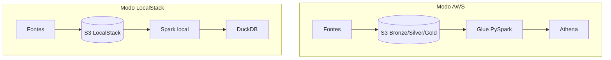

# Guia de execução e deploy

A pipeline roda em três modos, do mais simples ao mais completo. Todos partem do mesmo código; o que muda é onde os dados vivem e quem executa o processamento.

## Qual modo escolher

| Você quer... | Modo | Precisa de |
|---|---|---|
| Só ver a pipeline funcionando, rápido | `local` | uv, Java |
| Ver o caminho de nuvem sem custo nem conta | `localstack` | Docker, uv, Java, Terraform |
| Rodar de verdade na sua conta | `aws` | Terraform, AWS CLI com credenciais |

Antes de começar, cheque os pré-requisitos:

```bash
make doctor
```

## Uma nota de paridade honesta

O LocalStack Community (gratuito) cobre S3, Kinesis, Lambda, SNS, CloudWatch e IAM, mas não cobre Glue nem Athena. Então:

- Storage, streaming e monitoramento têm paridade real nos dois modos (provisionados por Terraform).
- O processamento das camadas e a consulta analítica, que na AWS rodam em Glue e Athena, no LocalStack rodam pelo Spark local (mesma lógica) e por DuckDB. É por isso que o root do LocalStack não tenta subir Glue, Athena e Step Functions gerenciados.

## Modo local

```bash
make setup
make local
```

Roda ingestão batch, streaming (em arquivo), Silver, Gold e o gate de qualidade. As camadas saem em `data/` no formato Parquet. Ao final você vê `gate de qualidade ... aprovado`.

## Modo LocalStack

```bash
make ls-up          # sobe LocalStack e Spark (docker compose)
make ls-deploy      # provisiona a infra e imprime as variaveis do .env
```

Copie as linhas que o `ls-deploy` imprime para o seu `.env` (buckets, endpoint, credenciais fictícias). Depois:

```bash
make ls-run         # roda a pipeline contra o S3 do LocalStack
```

Para consultar a Gold, aponte o DuckDB para os buckets do LocalStack ou baixe os Parquet gerados. Ao terminar:

```bash
make ls-destroy     # esvazia os buckets e destroi
make ls-down        # derruba os containers
```

## Modo AWS real

Pré-requisitos: credenciais configuradas (`aws configure`, SSO ou variáveis de ambiente) e permissão para criar IAM. Confirme com `aws sts get-caller-identity`.

```bash
cd infra/terraform/environments/aws
cp example.tfvars terraform.tfvars     # ajuste project, region e, se quiser, alert_email
cd -
make aws-deploy
```

Isso cria os buckets do medalhão, o catálogo Glue, os jobs, o stream Kinesis e a Lambda, a state machine, a agenda no EventBridge e o monitoramento. Os nomes de bucket recebem um sufixo aleatório, então não há colisão nem dependência de conta.

Rodar a pipeline sob demanda e acompanhar no console do Step Functions:

```bash
make aws-run
```

Consultar a Gold: no console do Athena, selecione o workgroup criado e o database `*_gold_*`, e rode as queries de [exemplos_consultas.md](exemplos_consultas.md).

Derrubar tudo, sem deixar custo residual:

```bash
make aws-destroy
```

O `force_destroy` (ligado no `example.tfvars`) e o `teardown.sh` esvaziam os buckets antes, então o destroy não trava em bucket não vazio.

## Custo

Detalhe e estimativa em [finops.md](finops.md). Em resumo: como ambiente efêmero (sobe, roda e destrói), o custo fica na ordem de centavos a poucos dólares e boa parte cabe no free tier. A maior alavanca é a frequência de execução do Glue.

## Fluxo dos dois modos


